# Vbee Worker Routing Workflow Trial

## Worker Role

This artifact simulates a worker perspective for a mixed Vbee batch.

Input batch:

```text
001_abc -> vbee_preview_download
002_ads -> vbee_official_download
003_xyz -> vbee_official_download
004_def -> vbee_official_download
005_sda -> vbee_preview_download
```

Worker split:

```text
Preview lane receives: 001_abc, 005_sda
Official lane receives: 002_ads, 003_xyz, 004_def
```

## Workflow Diagram

```mermaid
flowchart TD
  Batch["Batch Queue\n001, 002, 003, 004, 005"] --> Router["Worker Router\nread provider + executionMode"]

  Router --> PreviewLane["Preview Lane\nvbee_preview_download"]
  Router --> OfficialLane["Official Lane\nvbee_official_download"]

  PreviewLane --> P001["001_abc\nget session/JWT"]
  P001 --> P001Listen["insert text\ntrigger preview/listen"]
  P001Listen --> P001Capture["capture temporary audio URL"]
  P001Capture --> P001Download["download immediately"]

  PreviewLane --> P005["005_sda\nget session/JWT"]
  P005 --> P005Listen["insert text\ntrigger preview/listen"]
  P005Listen --> P005Capture["capture temporary audio URL"]
  P005Capture --> P005Download["download immediately"]

  OfficialLane --> O002["002_ads\nopen official flow"]
  O002 --> O002Gen["create voice item\nwait generated"]
  O002Gen --> O002Download["click/request official download"]

  OfficialLane --> O003["003_xyz\nopen official flow"]
  O003 --> O003Gen["create voice item\nwait generated"]
  O003Gen --> O003Download["click/request official download"]

  OfficialLane --> O004["004_def\nopen official flow"]
  O004 --> O004Gen["create voice item\nwait generated"]
  O004Gen --> O004Download["click/request official download"]

  P001Download --> Normalize["Normalize Provider Result"]
  P005Download --> Normalize
  O002Download --> Normalize
  O003Download --> Normalize
  O004Download --> Normalize

  Normalize --> FileService["FileService\nfinalize file + metadata"]
  FileService --> Assets["audio_assets\nGateway HTTP playback"]
```



## Trial Execution Trace

```text
worker-router:
  read pending jobs ordered by sequence
  load or roll human typing profile
  group by executionMode
  dispatch preview jobs to preview lane
  dispatch official jobs to official lane

preview-worker:
  001_abc -> human delay -> preview/listen -> temp URL -> immediate download -> normalized result
  005_sda -> human delay -> preview/listen -> temp URL -> immediate download -> normalized result

official-worker:
  002_ads -> human delay -> official create -> wait -> official download -> normalized result
  003_xyz -> human delay -> official create -> wait -> official download -> normalized result
  004_def -> human delay -> official create -> wait -> official download -> normalized result

file-service:
  receive normalized result
  write final audio file
  insert/update audio asset through Gateway-owned DB layer
```

## Human Pace Timing Trial

The worker keeps a typing profile for a short window, then randomizes again.

```text
typingWpm = random(40, 70)
reviewWpm = random(180, 260)
profileExpiresAt = now + random(8, 20 minutes)
profileJobBudget = random(3, 7 jobs)
```

Before each job:

```text
if now >= profileExpiresAt or profileJobBudget <= 0:
  roll a new typing profile
```

Delay formula:

```text
typingTime = wordCount / typingWpm * 60
reviewTime = wordCount / reviewWpm * 60
rawDelay = typingTime + reviewTime + actionTime
delay = clamp(rawDelay * random(0.85, 1.25), minDelay, maxDelay)
```

Example with one profile:

```text
profile:
  typingWpm = 54
  reviewWpm = 225
  profileJobBudget = 4

001_abc, 42 words, preview:
  typingTime = 46.7s
  reviewTime = 11.2s
  actionTime = 7s
  delay ~= 55-81s after jitter

002_ads, 130 words, official:
  typingTime = 144.4s
  reviewTime = 34.7s
  actionTime = 18s
  delay ~= 168-246s after jitter
```

## Worker Contract Shape

```js
{
  id: "job-id",
  provider: "vbee",
  executionMode: "vbee_preview_download",
  sequence: "001",
  slug: "abc",
  content: "..."
}
```

Worker output should be normalized regardless of lane:

```js
{
  provider: "vbee",
  executionMode: "vbee_preview_download",
  sequence: "001",
  slug: "abc",
  audioUrl: "temporary-or-provider-url",
  localAudioPath: null,
  metadata: {
    sourceFlow: "preview",
    format: "mp3"
  }
}
```

## Rules Proven By This Trial

- One batch can mix execution modes.
- Worker lanes can run independently while preserving sequence metadata.
- Human-paced delay is calculated from text length and a reusable typing profile.
- WPM is randomized again after a time window or job budget, not every single job.
- Vbee-specific details stay inside Vbee provider handlers.
- FileService receives a normalized result from both modes.
- Temporary URLs are downloaded immediately before finalization.
