# ZEROCLAW x VBEE TTS - MVP Architecture

Phiên bản: 2026-05-25  
Mục tiêu: vẽ rõ kiến trúc phần mềm để phát triển nhanh MVP có thể chạy end-to-end.

## 1. MVP cần đạt

MVP không cần đầy đủ Sound Editor nâng cao ngay. MVP cần chứng minh được 5 việc:

1. Mở browser thật với profile riêng và CDP port `9222`.
2. Client View thêm text vào queue.
3. Gateway worker lấy job, delay theo số từ/phút, gọi Vbee qua browser/API.
4. Tải audio về `.tmp`, rename thành `.mp3`, cập nhật SQLite.
5. UI nhìn thấy job hoàn tất và phát được file audio.

## 2. Kiến trúc tổng thể

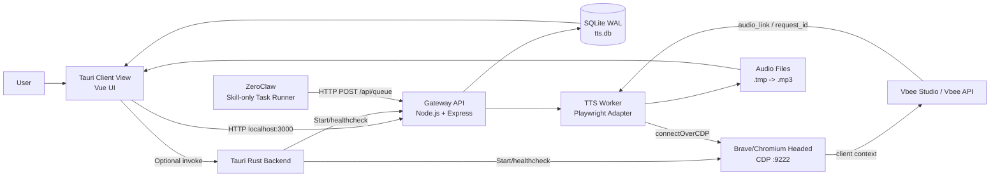

Quyết định quan trọng:

- UI và ZeroClaw đều chỉ gọi Gateway.
- Browser automation không nằm trong ZeroClaw.
- Worker được thiết kế dạng adapter để thay Brave CDP bằng Chromium CDP, Camoufox hoặc Patchright sau này.

## 3. Boundary của từng module

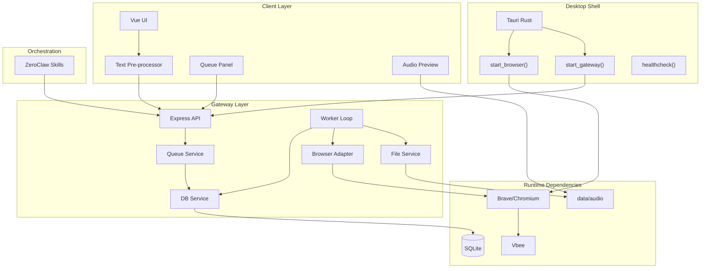

## 4. MVP package layout

```text
zeroclaw-vbee-tts/
  desktop/
    src/
      App.vue
      components/
        TextInputPanel.vue
        QueuePanel.vue
        AudioPreview.vue
    src-tauri/
      src/main.rs
      tauri.conf.json

  gateway/
    package.json
    server.js
    src/
      db.js
      schema.sql
      queue.js
      worker-loop.js
      browser/
        index.js
        playwright-cdp.js
        camoufox.js              # later
        patchright.js            # later
      services/
        file-service.js
        delay.js
        vbee-client.js

  zeroclaw/
    config.toml
    workspace/
      skills/
        vbee-hear-test/SKILL.toml
        vbee-change-sound/SKILL.toml

  data/
    brave-profile/
    audio/
    tts.db

  scripts/
    start-brave.bat
    start-gateway.bat
```

MVP tối giản có thể bỏ `desktop/` trong ngày đầu, test bằng curl/Gateway trước. Sau khi worker chạy được mới gắn UI.

## 5. Luồng khởi động

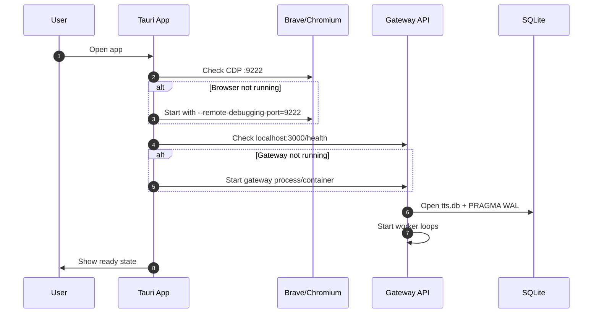

MVP command healthcheck:

```text
GET http://localhost:3000/health
GET http://localhost:9222/json/version
```

## 6. Luồng thêm job từ Client View

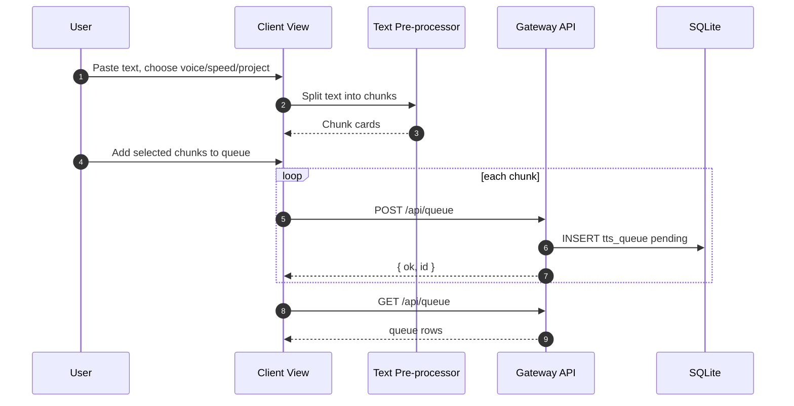

MVP UI chỉ cần:

- Textarea.
- Nút split.
- List chunk cards.
- Select voice.
- Slider speed.
- Checkbox incognito.
- Nút add to queue.
- Queue table.

## 7. Luồng ZeroClaw skill

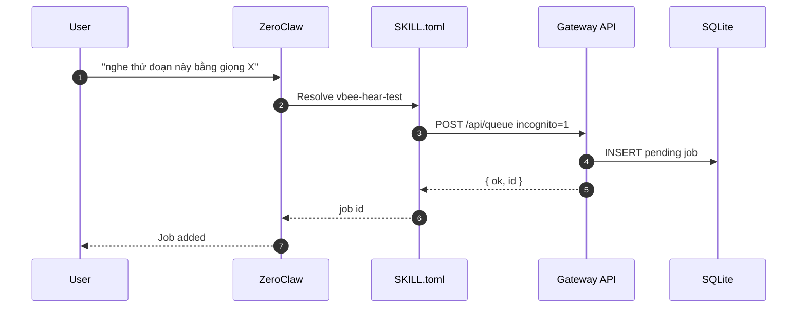

ZeroClaw MVP không cần browser tool, không cần shell tool.

## 8. Worker loop

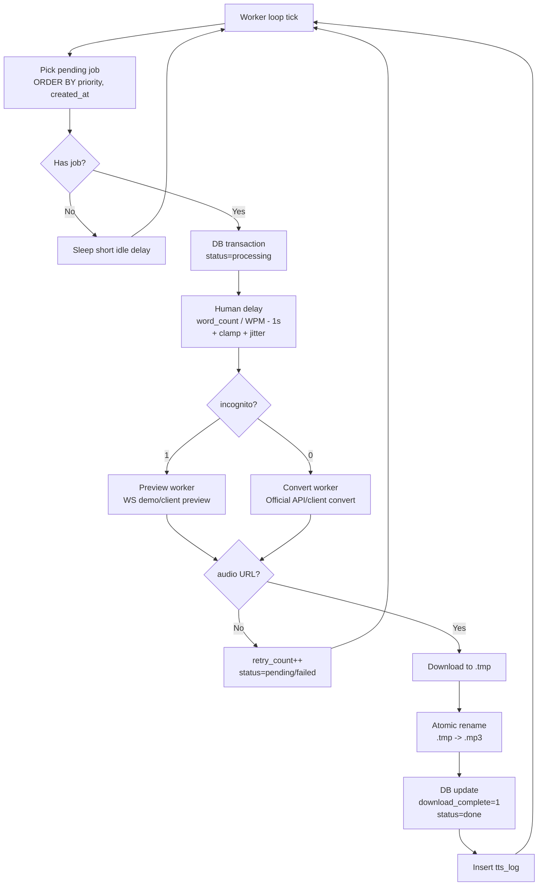

## 9. Browser adapter design

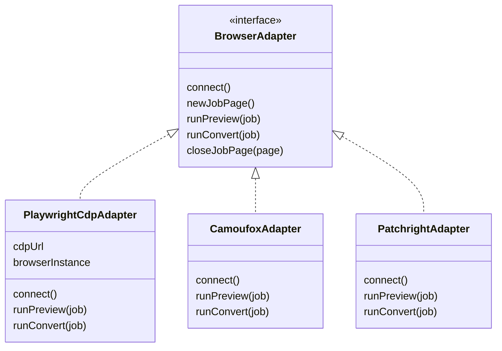

MVP chỉ implement `PlaywrightCdpAdapter`.

Interface ý tưởng:

```js
class BrowserAdapter {
  async connect() {}
  async runPreview(job) {}
  async runConvert(job) {}
}
```

`runPreview()` và `runConvert()` trả về:

```js
{
  audioUrl: 'https://...',
  requestId: null,
  metadata: {}
}
```

## 10. Delay service

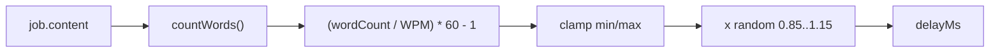

Code:

```js
function countWords(text) {
  return String(text || '').trim().split(/\s+/).filter(Boolean).length;
}

function estimateTypingDelayMs(text, wpm = 180, minSeconds = 2, maxSeconds = 90) {
  const wordCount = countWords(text);
  const seconds = (wordCount / wpm) * 60 - 1;
  const clamped = Math.max(minSeconds, Math.min(seconds, maxSeconds));
  const jitter = 0.85 + Math.random() * 0.3;
  return Math.round(clamped * jitter * 1000);
}
```

MVP nên dùng delay này thay vì random 10s-3min.

## 11. Database MVP ERD

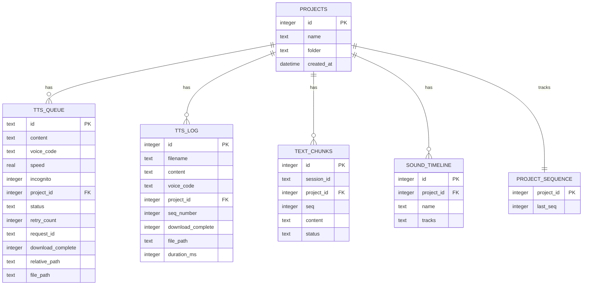

## 12. File state machine

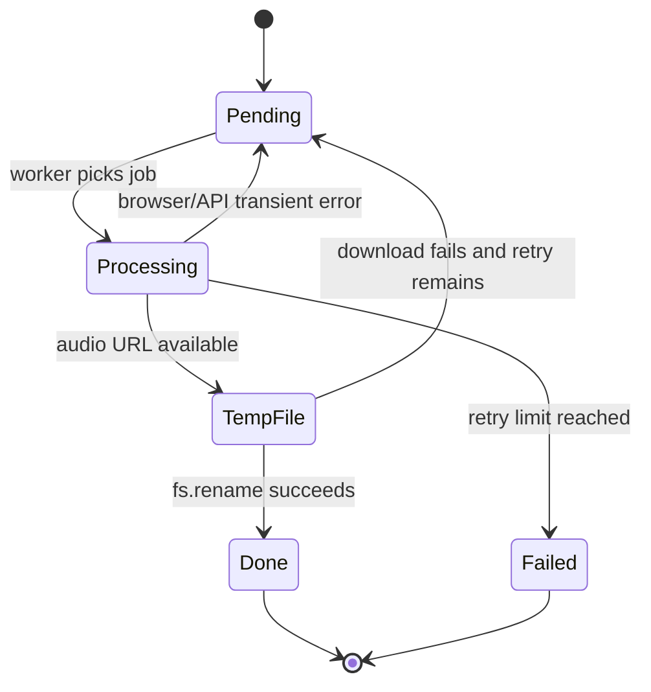

Rules:

- UI chỉ đọc file ở trạng thái `Done`.
- `Done` bắt buộc có `download_complete=1`.
- File `.tmp` không bao giờ hiển thị.
- File final chỉ được ghi bằng `rename`.

## 13. API surface cho MVP

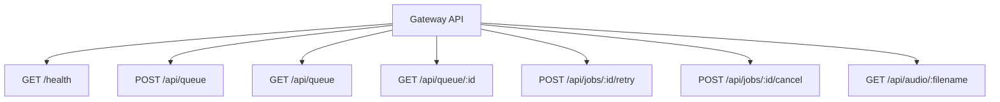

Response health:

```json
{
  "ok": true,
  "db": "ok",
  "browserCdp": "ok",
  "worker": "running"
}
```

POST queue:

```json
{
  "content": "Xin chao",
  "voice_code": "sg_female_tuongvy_call_44k-fhg",
  "speed": 1.05,
  "incognito": 1,
  "project_id": 1
}
```

## 14. MVP development order

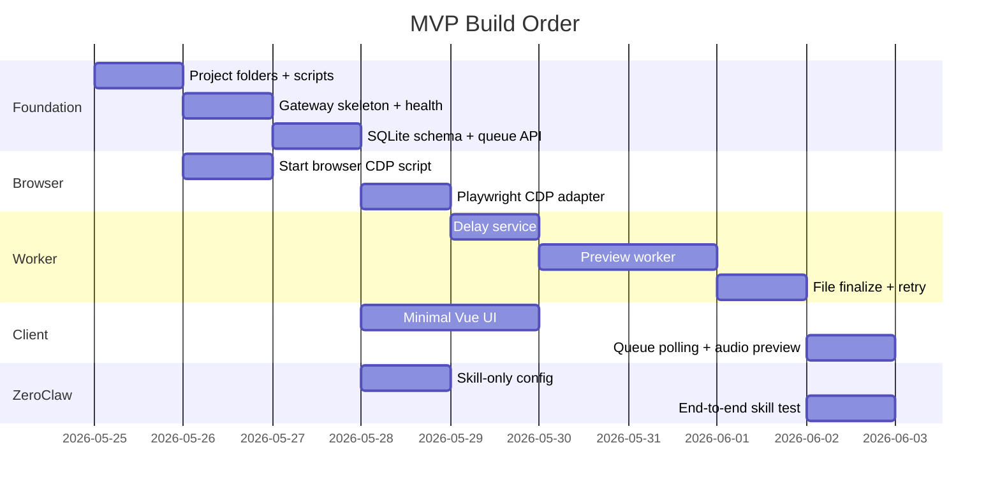

Practical order:

1. Gateway `/health`.
2. SQLite + `/api/queue`.
3. Browser CDP healthcheck.
4. Worker that marks fake jobs done.
5. Real Playwright preview worker.
6. File download/finalize.
7. Minimal UI.
8. ZeroClaw skills.
9. Convert official worker.
10. Sound Editor minimal.

## 15. MVP acceptance tests

### Test 1 - Browser ready

```bat
scripts\start-brave.bat
curl http://localhost:9222/json/version
```

Pass if response has browser/version JSON.

### Test 2 - Gateway ready

```bat
curl http://localhost:3000/health
```

Pass if `ok=true`.

### Test 3 - Add queue

```bat
curl -X POST http://localhost:3000/api/queue ^
  -H "Content-Type: application/json" ^
  -d "{\"content\":\"Xin chao\",\"voice_code\":\"sg_female_tuongvy_call_44k-fhg\",\"incognito\":1}"
```

Pass if response has job id and DB row exists.

### Test 4 - Worker finalizes file

Pass if:

- `data/audio/*.mp3` exists.
- No `.tmp` remains for completed job.
- `tts_queue.download_complete=1`.
- `tts_queue.status='done'`.

### Test 5 - UI sees audio

Pass if:

- Queue table shows `done`.
- Audio preview can play file.

## 16. What to defer after MVP

Do not build these first:

- Full multi-track Sound Editor.
- Camoufox/Patchright adapter.
- Proxy management.
- Auto JWT refresh.
- Installer packaging.
- Multi-user SaaS.
- Complex voice cache UI.

Build after MVP:

- Official convert worker.
- Text chunk reorder.
- Project sequence naming.
- GC maintenance worker.
- ffmpeg export timeline.
- Tauri sidecar packaging.

