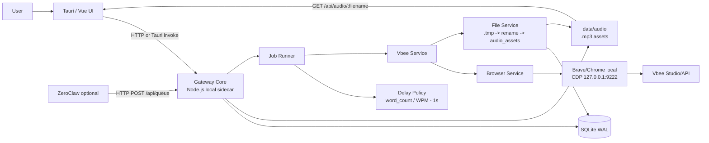
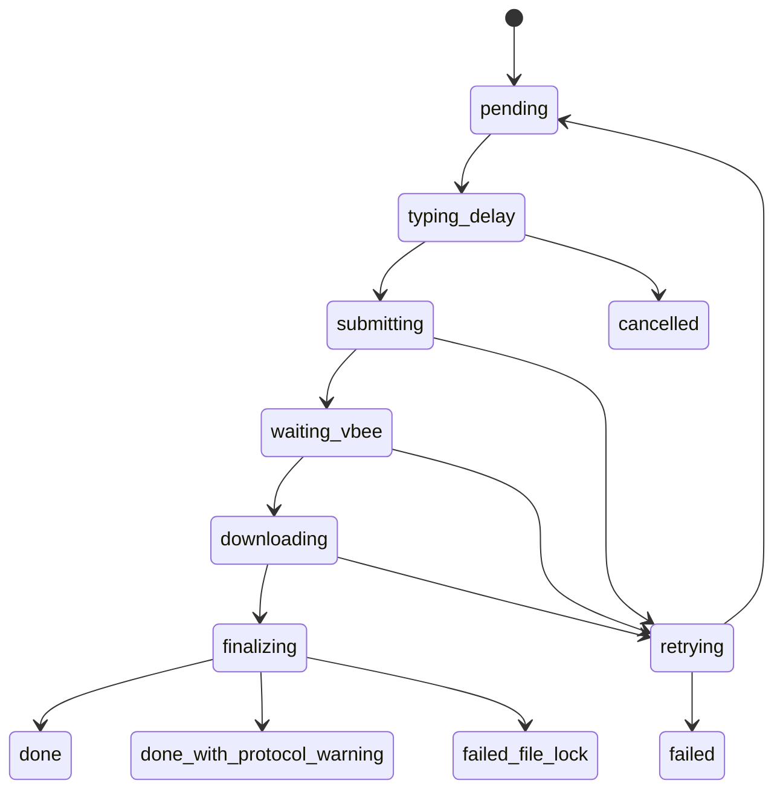

# ZEROCLAW x VBEE TTS - Phase 1 Design

Ngày: 2026-05-25  
Mục tiêu: thiết kế giai đoạn 1 để phát triển MVP local-first, có thể mang sang máy khác, nhưng chưa khóa kiến trúc vào `localhost` hoặc Podman.

## 1. Mục tiêu giai đoạn 1

Giai đoạn 1 không làm full product. Giai đoạn này chỉ cần chứng minh app local chạy được end-to-end:

```text
User nhập text
-> UI tách chunk
-> Gateway nhận job
-> Worker delay theo số từ/phút
-> Browser local đã login Vbee
-> Vbee trả audio
-> Gateway tải .tmp
-> rename .mp3
-> insert audio_assets
-> UI phát audio
```

Acceptance cut line:

- App mở được dù Vbee/browser chưa sẵn sàng.
- Gateway local chạy được và có `/health`.
- Browser local mở CDP port `9222`.
- User login Vbee thủ công lần đầu.
- Thêm ít nhất 1 job preview/incognito.
- File audio xuất hiện trong `data/audio`.
- `audio_assets` có row.
- UI phát được audio qua Gateway API.
- ZeroClaw và Podman không bắt buộc.

## 2. Quyết định kiến trúc Phase 1

### 2.1 Local-first

Phase 1 chạy trên một máy:

```text
Tauri UI
Gateway Core local
SQLite local
Audio files local
Browser local
Vbee session local
```

Không dùng remote Gateway trong Phase 1. Tuy nhiên config phải không hard-code `localhost` ở nhiều nơi để sau này thêm remote mode.

### 2.2 Gateway là core

Gateway Core là process duy nhất ghi SQLite và quản lý worker.

```text
UI -> Gateway API
ZeroClaw -> Gateway API optional
Worker -> Gateway services
Gateway -> SQLite/audio files/browser/Vbee
```

Không cho UI hoặc ZeroClaw đọc/ghi DB trực tiếp.

### 2.3 ZeroClaw optional

ZeroClaw trong Phase 1 chỉ là automation client:

```text
ZeroClaw skill -> POST /api/queue
```

App phải chạy end-to-end nếu không có ZeroClaw.

### 2.4 Podman optional

Podman không là runtime mặc định Phase 1.

Runtime mặc định:

```text
Tauri starts local Gateway
Gateway runs on 127.0.0.1:3000
Browser runs on 127.0.0.1:9222
```

Podman chỉ giữ làm advanced/dev option sau.

## 3. Phase 1 Architecture



## 4. Module boundaries

Phase 1 phải tránh lỗi "folder đẹp nhưng vẫn cross-import tự do".

Boundary đề xuất:

```text
api/
  chỉ nhận request, validate payload, gọi application service

application/
  queue-service
  job-runner
  delay-policy
  không import Playwright, fs raw, better-sqlite3 raw

ports/
  browser-port
  vbee-port
  file-port
  db-port

infrastructure/
  sqlite-repository
  playwright-cdp-adapter
  browser-session-vbee-adapter
  local-file-service
```

Rule quan trọng:

```text
JobRunner không import playwright.
JobRunner không import fs.
JobRunner không import better-sqlite3.
JobRunner chỉ gọi ports/services.
```

## 5. Tauri-Gateway lifecycle

Đây là foundation của Phase 1.

Tauri phải:

- Kiểm tra Gateway tại `GET /health`.
- Nếu chưa chạy, start Gateway local.
- Poll health mỗi 3-5 giây.
- Không crash khi Gateway hoặc Browser chưa sẵn sàng.
- Hiển thị degraded state rõ ràng.

Health response:

```json
{
  "ok": true,
  "gateway": "running",
  "db": "ok",
  "browserCdp": "unavailable",
  "vbeeSession": "unknown",
  "worker": "running",
  "degraded": true
}
```

UI behavior:

| State | UI behavior |
|---|---|
| Gateway unavailable | show "Start Gateway" / retry |
| Gateway ok, Browser unavailable | app vẫn mở, disable queue buttons cần Vbee |
| Browser ok, Vbee not logged in | show "Open Vbee login" |
| Vbee ok | enable queue |

Port conflict:

- Nếu `127.0.0.1:3000` bận bởi process khác, không kill.
- Hiện thông báo: "Gateway port is occupied".
- Cho phép đổi port trong config.

## 6. Local packaging cho Vbee runtime

Vbee không được "đóng gói" như code. Thứ cần đóng gói là runtime context:

- Browser starter.
- Browser profile riêng.
- Gateway worker biết cách gọi Vbee.
- Config Vbee.
- Voice cache/default voice.
- Onboarding login.

Không đóng gói:

- Session Vbee đã login của người khác.
- JWT thật.
- Browser profile cá nhân đã login.
- Hard-coded absolute path.

### 6.1 Browser strategy Phase 1

Phase 1 dùng browser đã cài trên máy:

```text
Chrome/Brave installed browser
profile riêng trong app data
CDP port 9222
user login Vbee lần đầu
```

Bundle Chromium để sau, khi cần distribution cho người ít kỹ thuật.

Start command:

```bat
chrome.exe ^
  --remote-debugging-port=9222 ^
  --user-data-dir="%APPDATA%\ZeroClawTTS\browser-profile" ^
  --no-first-run ^
  --no-default-browser-check ^
  https://studio.vbee.vn
```

### 6.2 Onboarding máy mới

Flow:

```text
1. User mở app.
2. App start/check Gateway.
3. App check browser CDP.
4. Nếu chưa có profile/login:
   - mở browser tới studio.vbee.vn
   - UI hiện "Please login Vbee"
5. User login thủ công.
6. App healthcheck session.
7. Queue buttons được enable.
```

Không giả định copy profile sang máy khác là đủ. Khi chuyển máy, user nên login lại Vbee.

## 7. Config Phase 1

Config không hard-code `localhost` rải rác.

```json
{
  "gateway": {
    "mode": "local-sidecar",
    "url": "http://127.0.0.1:3000",
    "port": 3000
  },
  "browser": {
    "type": "installed",
    "cdpUrl": "http://127.0.0.1:9222",
    "cdpPort": 9222,
    "profileDir": "%APPDATA%/ZeroClawTTS/browser-profile"
  },
  "vbee": {
    "studioUrl": "https://studio.vbee.vn",
    "authMode": "browser-session",
    "requiresManualLogin": true,
    "defaultVoiceCode": "sg_female_tuongvy_call_44k-fhg"
  },
  "audio": {
    "outputDir": "%APPDATA%/ZeroClawTTS/audio",
    "access": "gateway-http"
  },
  "delayPolicy": {
    "type": "word_count_wpm",
    "wpm": 180,
    "minSeconds": 2,
    "maxSeconds": 90,
    "jitterMin": 0.85,
    "jitterMax": 1.15
  }
}
```

Remote mode để sau nhưng config đã có chỗ mở rộng:

```json
{
  "gateway": {
    "mode": "remote-lan",
    "url": "http://192.168.1.50:3000"
  }
}
```

## 8. Gateway API Phase 1

Tối thiểu:

```text
GET  /health
POST /api/queue
GET  /api/queue
GET  /api/jobs/:id
POST /api/jobs/:id/retry
POST /api/jobs/:id/cancel
GET  /api/assets
GET  /api/audio/:filename
```

Payload:

```json
{
  "content": "Xin chao",
  "voice_code": "sg_female_tuongvy_call_44k-fhg",
  "speed": 1.05,
  "incognito": 1,
  "project_id": 1
}
```

Audio access:

```text
UI không đọc file path trực tiếp.
UI phát audio qua GET /api/audio/:filename.
```

Điều này giúp sau này remote Gateway không phải đổi Sound Editor quá nhiều.

## 9. Database Phase 1

SQLite nằm cùng máy với Gateway.

Không đặt SQLite trên OneDrive/SMB/NAS trong Phase 1 vì dễ lock/corrupt.

Core tables:

```text
projects
project_sequence
tts_queue
tts_log
audio_assets
text_chunks later
sound_timeline later
```

`audio_assets` là bảng Sound Editor đọc:

```sql
CREATE TABLE IF NOT EXISTS audio_assets (
  id TEXT PRIMARY KEY,
  project_id INTEGER REFERENCES projects(id),
  source_job_id TEXT UNIQUE REFERENCES tts_queue(id),
  filename TEXT NOT NULL,
  relative_path TEXT NOT NULL,
  file_path TEXT NOT NULL,
  content TEXT,
  voice_code TEXT,
  speed REAL,
  duration_ms INTEGER,
  sample_rate INTEGER,
  channels INTEGER,
  created_at DATETIME DEFAULT CURRENT_TIMESTAMP
);
```

Job status:

```text
pending
typing_delay
submitting
waiting_vbee
downloading
finalizing
done
retrying
failed
cancelled
done_with_protocol_warning
failed_file_lock
```

## 10. Worker execution flow



Important rule:

```text
VbeeService returns audioUrl.
FileService downloads immediately in the same async chain.
No queue buffer between audioUrl and download.
```

Reason: presigned URL may expire quickly.

## 11. Delay Policy

Phase 1 dùng delay theo số từ/phút.

Formula:

```text
typing_seconds = (word_count / words_per_minute) * 60 - 1
typing_seconds = clamp(typing_seconds, minSeconds, maxSeconds)
typing_seconds = typing_seconds * jitter
```

Code:

```js
function countWords(text) {
  return String(text || '').trim().split(/\s+/).filter(Boolean).length;
}

function estimateTypingDelayMs(text, wpm = 180, minSeconds = 2, maxSeconds = 90) {
  const wordCount = countWords(text);
  const seconds = (wordCount / wpm) * 60 - 1;
  const clamped = Math.max(minSeconds, Math.min(seconds, maxSeconds));
  const jitter = 0.85 + Math.random() * 0.3;
  return Math.round(clamped * jitter * 1000);
}
```

Test mode:

```text
DELAY_POLICY=none
VBEE_ADAPTER=fake
```

Không để test integration chờ 3 phút.

## 12. Vbee Adapter Phase 1

Adapters:

```text
FakeVbeeAdapter       # bắt buộc cho dev/test
BrowserSessionAdapter # dùng browser session local
OfficialApiAdapter    # skeleton hoặc nếu token/app id dùng được
```

Phase 1 ưu tiên:

1. Fake adapter để UI/Gateway chạy sớm.
2. Browser session adapter cho preview/incognito.
3. Official API adapter sau nếu API/JWT ổn.

### 12.1 WS protocol requirement

Preview/incognito qua BrowserSessionAdapter phải record/verify frame sequence:

```text
server INIT
client INIT status=1
client SYNTHESIS
server SYNTHESIS IN_PROGRESS
server SYNTHESIS SUCCESS
client GET_REMAINING_PREVIEW
server GET_REMAINING_PREVIEW
```

Nếu nhận được audio link nhưng không confirm được `GET_REMAINING_PREVIEW`, job không nên coi là success sạch. Dùng:

```text
done_with_protocol_warning
```

## 13. File Service Phase 1

Rules:

- Download vào `.tmp`.
- Không expose `.tmp`.
- Rename `.tmp -> .mp3`.
- Sau rename, DB writes phải nằm trong một transaction:
  - insert `audio_assets`
  - update `tts_queue.status='done'`
  - insert `tts_log`
- `audio_assets.source_job_id` unique để retry không duplicate.

Windows file lock:

- Retry khi `EPERM` hoặc `EBUSY`.
- Backoff: `200ms, 500ms, 1s, 2s, 5s`.
- Nếu vẫn fail: `failed_file_lock`.

Không rename file cũ khi migration. Với file cũ, `audio_assets.relative_path` trỏ đúng file hiện có.

## 14. Remote Gateway - design-supported, not Phase 1

Bạn đã hỏi remote Gateway. Kết luận:

- Phase 1 chưa làm remote.
- Nhưng thiết kế phải không khóa vào local file path.
- UI phát audio qua Gateway HTTP, không đọc local path.
- Config có `gateway.url`.

Remote mode tương lai:

```text
Machine A: Tauri UI / ZeroClaw client
Machine B: Gateway + Browser + SQLite + Audio files
```

Rules tương lai:

- Gateway owns browser, DB, audio files.
- Browser CDP chỉ bind `127.0.0.1` trên máy Gateway.
- Không expose CDP port ra LAN.
- Remote Gateway bắt buộc auth token.
- SQLite không chạy qua network drive.

## 15. Phase 1 development order

Thứ tự làm:

1. Gateway Core skeleton: `/health`, config, DB open.
2. Tauri-Gateway lifecycle: start/check Gateway, degraded mode.
3. SQLite schema: `tts_queue`, `audio_assets`, WAL.
4. Fake worker: job -> fake asset.
5. UI minimal: health, add queue, queue table, asset list, audio preview.
6. Browser start/check: CDP `9222`.
7. Vbee onboarding: open Vbee login, session health.
8. BrowserSessionAdapter preview/incognito.
9. File Service thật: `.tmp -> .mp3 -> audio_assets`.
10. Delay Policy.
11. ZeroClaw optional skill.
12. Cleanup docs and acceptance tests.

UI work can start as soon as `/health`, `/api/queue`, and `/api/assets` exist.

## 16. Phase 1 tests

### Gateway lifecycle

- Gateway not running -> app/script starts it.
- Gateway unavailable -> UI shows retry/start state.
- Browser unavailable -> `/health.degraded=true`, not 500.
- Port 3000 occupied -> actionable error.

### DB

- WAL enabled.
- Job insert works.
- Asset insert works.
- `source_job_id` unique prevents duplicates.

### Delay

- Empty text -> min delay.
- Normal text -> formula result.
- Huge text -> max delay.
- Integration test uses `DELAY_POLICY=none`.

### Vbee protocol

- Recorder confirms `GET_REMAINING_PREVIEW`.
- Missing frame -> `done_with_protocol_warning`.

### File

- `.tmp` not visible in `/api/assets`.
- Rename success inserts asset.
- Simulated `EPERM` retries.

### UI

- App opens without browser.
- Queue button disabled until runtime ready.
- Audio plays via `/api/audio/:filename`.

## 17. Deferred after Phase 1

Không làm trong giai đoạn 1:

- Remote Gateway implementation.
- Bundle Chromium portable.
- Full Sound Editor multi-track.
- Camoufox/Patchright.
- Proxy management.
- Auto JWT refresh.
- Installer thương mại.
- Podman default runtime.
- Multi-user SaaS.

Làm sau Phase 1:

- Bundle Chromium nếu cần distribution dễ hơn.
- Official API adapter đầy đủ.
- Sound Editor timeline.
- ffmpeg export.
- Remote Gateway LAN/VPN mode.
- Packaging installer.

## 18. Final decision

Phase 1 là local-first app có Gateway Core. Ta không cố "đóng gói Vbee account"; ta đóng gói môi trường chạy và onboarding để user login Vbee trên từng máy.

Thiết kế đúng cho Phase 1:

```text
Portable app, machine-local Vbee login,
Gateway owns DB/files/workers,
UI talks only to Gateway API,
Browser session stays local,
remote mode left open by config.
```

