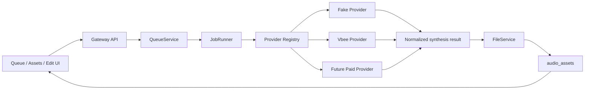

# VoiceFactory Provider Adapter Contract

## Purpose

VoiceFactory is not limited to Vbee. Vbee is the first provider target, while the product architecture must allow additional paid TTS services to be added later.

The core rule:

```text
New TTS provider = new provider adapter, not new job runner logic.
```

## Workflow



## Adapter Boundary

Provider adapters own external TTS details:

```text
auth
voice mapping
provider-specific request payload
browser session or API call
polling/protocol handling
provider errors
temporary audio URL discovery
execution mode handling, such as Vbee preview download vs official download
```

Provider adapters must not own:

```text
SQLite writes
asset insertion
timeline editing
UI behavior
final file naming
direct audio serving
```

## Proposed Contract

```js
class TtsProviderAdapter {
  async synthesize(job, context) {
    return {
      provider: 'provider-name',
      requestId: 'provider-request-id',
      audioUrl: 'https://...',
      localAudioPath: null,
      metadata: {
        voiceCode: job.voice_code,
        executionMode: job.execution_mode,
        format: 'mp3',
        protocolWarnings: []
      }
    };
  }
}
```

For fake/local providers, `audioUrl` may be omitted if the orchestration uses a local generated fixture. Real paid providers should prefer returning a downloadable URL or stream handle that FileService finalizes.

## Provider Documentation Template

Each new provider must include a docs file:

```text
docs/providers/<provider-name>.md
```

Template:

```markdown
# Provider: <Name>

## Auth Method

## Input Limits

## Voice Selection Model

## Rate Limits / Delay Policy

## Output Format

## Download And Finalization Flow

## Error Mapping

## Test Strategy

## Known Account / ToS Constraints
```

## Initial Providers

```text
fake      -> development and tests
vbee      -> first real provider target
future-*  -> paid providers added by adapter contract
```

## Execution Mode Routing

Some providers have multiple valid execution workflows. For Vbee, VoiceFactory currently recognizes two future real-provider modes:

```text
vbee_preview_download   -> use authenticated app/session preview flow and still download the preview audio
vbee_official_download  -> use the normal software generation/download flow
```

A batch may mix modes per item. The queue should persist the chosen mode, and the runner should route to provider handlers by contract.

Detailed Vbee workflow notes live in:

```text
docs/design/07_vbee-dual-execution-workflows.md
```

## Non-Negotiable Rules

- JobRunner must call provider contracts, not provider-specific browser/API code.
- UI must not contain provider credentials or protocol logic.
- Provider adapters must not write SQLite.
- Audio playback must still go through Gateway `/api/audio/:filename`.
- Temporary URLs must be downloaded immediately in the same job execution chain.
