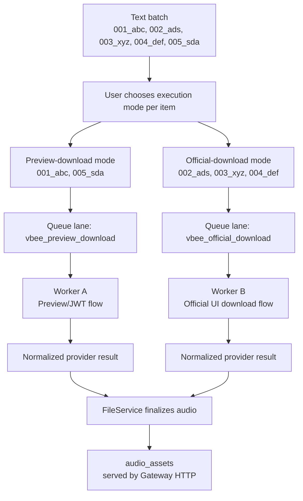

# Vbee Dual Execution Workflows

## Purpose

Vbee integration has two valid execution workflows. VoiceFactory must allow a text list to mix both workflows per item, then route jobs to workers by execution mode.

This is a design decision for the real Vbee provider path, not an implemented M1 behavior yet.

## Workflow



## Execution Modes

### `vbee_preview_download`

This mode uses the application/session JWT path to insert or request preview text and capture the preview audio result.

Expected behavior:

```text
get authenticated app/session state
submit or inject preview text
trigger preview/listen flow
discover the temporary audio URL or response payload
download immediately
return normalized provider result
```

This is useful for items that should be generated through the listening/preview path but still saved as assets.

### `vbee_official_download`

This mode follows the normal Vbee software flow where the item is created and downloaded through the intended download path.

Expected behavior:

```text
open or reuse authenticated browser session
create the voice item through the product flow
wait for generation completion
click or request the official download action
download immediately
return normalized provider result
```

This is useful for production items that should match the provider's regular software workflow.

## Mixed Batch Example

Input list:

```text
001_abc -> vbee_preview_download
002_ads -> vbee_official_download
003_xyz -> vbee_official_download
004_def -> vbee_official_download
005_sda -> vbee_preview_download
```

Worker routing:

```text
Worker A receives: 001_abc, 005_sda
Worker B receives: 002_ads, 003_xyz, 004_def
```

The original item order is preserved in job metadata and output naming, but execution may happen in separate lanes.

## Queue Payload Direction

Future queue jobs should carry an explicit execution mode:

```json
{
  "provider": "vbee",
  "executionMode": "vbee_preview_download",
  "sequence": "001",
  "slug": "abc",
  "content": "..."
}
```

Allowed initial modes:

```text
fake
vbee_preview_download
vbee_official_download
```

The UI should support selecting a default mode for a batch and overriding the mode per text item.

## Worker Pattern

Use a routed worker pattern:

```text
JobRunner
  -> ProviderRegistry
  -> ProviderAdapter
  -> ExecutionModeHandler
```

The JobRunner should not contain Vbee-specific branches. It should route by provider and execution mode through adapter contracts.

The Vbee adapter may internally expose two handlers:

```text
VbeePreviewDownloadHandler
VbeeOfficialDownloadHandler
```

Both handlers must return the same normalized synthesis result shape for FileService finalization.

## Human Pace Scheduler

Worker delay should model a human operator instead of using a fixed delay.

The worker owns a typing profile per provider account/session:

```text
typingWpm = random(40, 70)
reviewWpm = random(180, 260)
profileExpiresAt = now + random(8, 20 minutes)
profileJobBudget = random(3, 7 jobs)
```

The profile is reused across jobs until either `profileExpiresAt` passes or `profileJobBudget` reaches zero. Then the worker rolls a new profile.

Delay formula:

```text
typingTime = wordCount / typingWpm * 60
reviewTime = wordCount / reviewWpm * 60
rawDelay = typingTime + reviewTime + actionTime
delay = clamp(rawDelay * random(0.85, 1.25), minDelay, maxDelay)
```

Mode defaults:

```text
vbee_preview_download:
  actionTime = random(4, 10 seconds)
  minDelay = 12 seconds
  maxDelay = 180 seconds

vbee_official_download:
  actionTime = random(10, 25 seconds)
  minDelay = 25 seconds
  maxDelay = 300 seconds
```

The account throttle is shared across both execution lanes. Even if preview and official workers are separate, one provider account/session should not perform overlapping browser actions unless a later milestone explicitly proves it is safe.

## Design Constraints

- UI chooses provider and execution mode, but never owns JWT, browser, or download protocol logic.
- QueueService persists provider, execution mode, sequence, and item metadata.
- JobRunner routes by contract only.
- Vbee-specific JWT, preview, browser, and official download steps stay inside Vbee provider adapter code.
- Worker delay uses a reusable human typing profile, then randomizes WPM again after a time/job window.
- Both modes must download temporary/presigned URLs immediately in the same job execution chain.
- Both modes must finalize audio through FileService, not directly from the adapter.
- Gateway remains the only SQLite writer.

## Known Limits

This design does not yet decide the exact Vbee DOM selectors, network interception method, or JWT extraction method.

This design does not yet decide whether the two worker lanes run as two processes, two async queues, or one scheduler with per-mode concurrency.

This design does not yet define retry policy differences between preview and official download modes.
