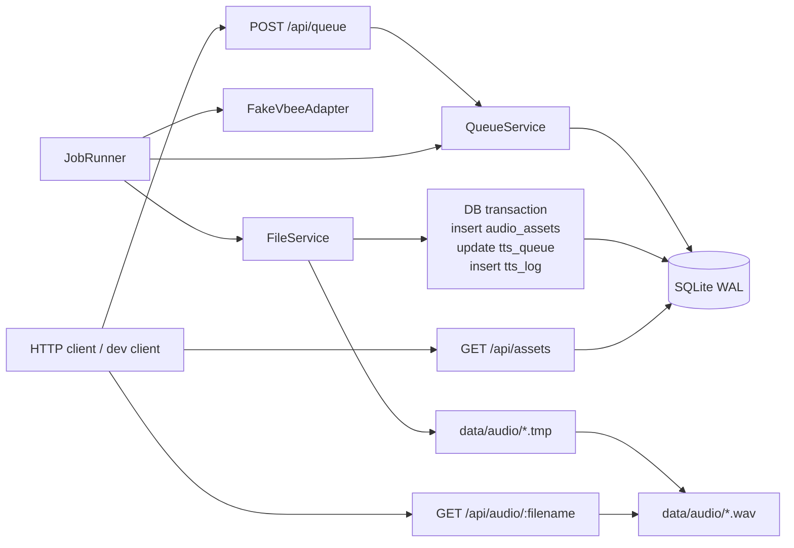

# M0_001 - Gateway Core Fake End-to-End

Milestone: `M0 - Gateway Core Fake End-to-End`

## Workflow



## What Was Implemented

Gateway Core now runs as a local Node process with these API endpoints:

```text
GET  /health
POST /api/queue
GET  /api/queue
GET  /api/jobs/:id
POST /api/jobs/:id/retry
POST /api/jobs/:id/cancel
GET  /api/assets
GET  /api/audio/:filename
```

The fake worker can process a submitted queue job into a playable audio asset. The generated audio is a deterministic silent WAV file, used only to validate the end-to-end pipeline before real Vbee integration.

Implemented files:

```text
server.js
gateway/src/server.js
gateway/src/config.js
gateway/src/api/routes.js
gateway/src/api/http-utils.js
gateway/src/application/queue-service.js
gateway/src/application/job-runner.js
gateway/src/infrastructure/db/sqlite.js
gateway/src/infrastructure/files/file-service.js
gateway/src/vbee/adapters/fake-vbee.js
```

## Design Patterns

### Gateway As Application Core

Gateway is the only runtime that owns queue state, SQLite writes, worker orchestration, file finalization, and asset serving.

This follows the architecture decision from the design docs:

```text
UI / ZeroClaw clients -> Gateway API -> services/adapters -> SQLite/files
```

### Ports And Adapters, Kept Lightweight

M0 uses a lightweight version of ports/adapters:

```text
JobRunner -> QueueService
JobRunner -> FakeVbeeAdapter
JobRunner -> FileService
```

The worker does not directly know Vbee internals. Real browser/session logic can replace `FakeVbeeAdapter` later without changing the queue API shape.

### Transaction Script For Finalization

After the audio file is renamed from `.tmp` to final `.wav`, the database writes happen as one SQLite transaction:

```text
insert audio_assets
update tts_queue status='done'
insert tts_log
```

This keeps job state and playable asset state consistent.

## Verification

Primary smoke test:

```bash
cd /mnt/d/Github/ZeroClaw-Vbee-Automate
npm run smoke
```

Expected proof:

```text
/health returns ok
POST /api/queue creates job
fake worker creates data/audio/*.wav
/api/assets returns finalized asset
/api/audio/:filename downloads audio
```

## Known Limits

Real Vbee integration is not implemented here.

Browser CDP health is currently reported as `unavailable`.

Generated audio is silent WAV, not Vbee MP3.

