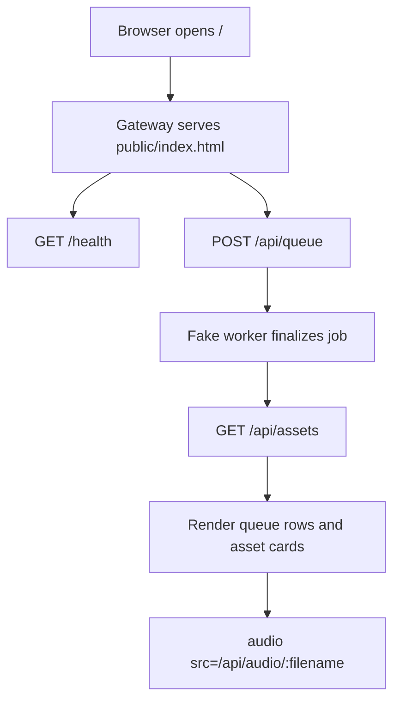

# M0_002 - Dev Client Gateway Validation

Milestone: `M0 - Gateway Core Fake End-to-End`

## Workflow



## What Was Implemented

A temporary static dev client now ships from Gateway at:

```text
http://127.0.0.1:3000/
```

It can:

```text
show runtime health
submit text into queue
display queue rows
display finalized audio assets
play audio through /api/audio/:filename
```

Implemented files:

```text
public/index.html
public/styles.css
public/app.js
.context/modules/DEV_CLIENT.md
```

Gateway static serving was added through:

```text
gateway/src/api/routes.js
gateway/src/api/http-utils.js
```

## Design Patterns

### API Client Boundary

The dev client uses the same Gateway HTTP API that future Tauri UI and ZeroClaw clients must use.

It does not read:

```text
SQLite
local file paths
Vbee credentials
browser CDP
environment values
```

### Validation Surface, Not Product UI

The dev client is intentionally static and dependency-free. Its purpose is to validate the Gateway contract before adding Tauri/Vue complexity.

This keeps the feedback loop short:

```text
change Gateway -> refresh browser -> verify queue/assets/audio
```

### Gateway-Owned Static Serving

Gateway serves the dev client and API from the same origin. This avoids CORS setup while the API contract is still forming.

## Verification

Manual test:

```bash
cd /mnt/d/Github/ZeroClaw-Vbee-Automate
npm run online
```

Then open:

```text
http://127.0.0.1:3000/
```

Acceptance proof captured:

```text
submit job from browser
queue row becomes done
asset card appears
audio player points to /api/audio/:filename
```

Screenshot artifact:

```text
artifacts/dev-client-smoke.png
```

## Known Limits

This is not the final app UI.

Text chunk splitting is not implemented.

Voice catalog management is not implemented.

Sound Editor timeline is not implemented.

