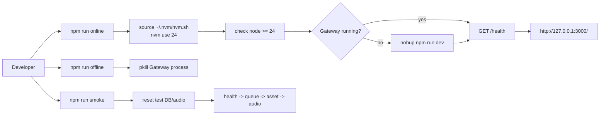

# M0_003 - Dev Runtime Scripts

Milestone: `M0 - Gateway Core Fake End-to-End`

## Workflow



## What Was Implemented

Runtime helper scripts were added so manual testing does not require hand-written shell commands each time.

Implemented scripts:

```text
scripts/dev-online.sh
scripts/dev-offline.sh
scripts/smoke-gateway.sh
```

Package aliases:

```json
{
  "online": "bash scripts/dev-online.sh",
  "offline": "bash scripts/dev-offline.sh",
  "smoke": "bash scripts/smoke-gateway.sh"
}
```

## Design Patterns

### Scripted Developer Workflow

The scripts encode repeated operational knowledge:

```text
load nvm
select Node 24
start Gateway safely
wait for health
print test URL
stop Gateway when needed
```

This reduces drift between what the project expects and what the developer actually runs.

### Health-Gated Startup

`npm run online` does not stop at spawning a process. It waits until `/health` returns successfully, then prints the URL.

This creates a small but important operational contract:

```text
online means usable, not merely spawned
```

### Reproducible Smoke Test

`npm run smoke` resets test DB/audio output, starts Gateway, exercises the API, downloads an audio file, prints evidence, and stops the temporary process.

## Verification

Verified commands:

```bash
npm run offline
npm run online
npm run smoke
```

Expected online URL:

```text
http://127.0.0.1:3000/
```

Expected health:

```json
{
  "ok": true,
  "gateway": "running",
  "db": "ok",
  "browserCdp": "unavailable",
  "vbeeSession": "fake",
  "worker": "running",
  "degraded": false
}
```

## Known Limits

Scripts assume WSL Debian and `nvm`.

Scripts assume Node 24 is available through `nvm`.

Production service supervision is not implemented here. Tauri lifecycle supervision belongs to `M1`.

