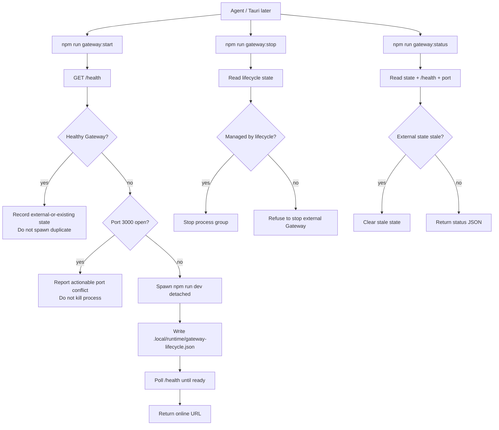

# M1_001 - Gateway Lifecycle CLI

Milestone: `M1 - Tauri Gateway Lifecycle`

## Workflow



## What Was Implemented

A reusable Gateway lifecycle CLI was added before Tauri exists. This gives the project a tested startup policy that Tauri can later call or port.

Implemented commands:

```bash
npm run gateway:start
npm run gateway:status
npm run gateway:stop
npm run smoke:lifecycle
```

Implemented files:

```text
scripts/gateway-lifecycle.mjs
scripts/smoke-lifecycle.sh
scripts/test-port-occupier.mjs
package.json
.context/modules/GATEWAY_LIFECYCLE.md
```

## Design Patterns

### Lifecycle Manager

The lifecycle manager owns process startup policy:

```text
check health
detect conflict
spawn if needed
record ownership
stop only owned process
```

This keeps lifecycle rules out of ad hoc scripts and prepares the same behavior for Tauri integration.

### Health-Gated Startup

`gateway:start` only reports success after `/health` returns `ok=true`.

This preserves the operational invariant:

```text
started means usable, not merely spawned
```

### Ownership Boundary

The lifecycle manager writes ownership state to `.local/runtime/gateway-lifecycle.json`.

If Gateway is already healthy but was not started by the lifecycle manager, it records:

```text
mode = external-or-existing
```

In that state, `gateway:stop` refuses to kill the process. This prevents the future Tauri shell from killing a developer-managed Gateway or another process.

### Port Conflict Guard

If port `3000` is occupied but `/health` is unavailable, startup fails with an actionable conflict.

It does not kill the process occupying the port.

## Verification

Full lifecycle smoke:

```bash
cd /mnt/d/Github/ZeroClaw-Vbee-Automate
npm run smoke:lifecycle
```

Verified cases:

```text
Gateway absent -> gateway:start spawns and waits for /health
Managed Gateway -> gateway:stop stops process group
External healthy Gateway -> gateway:start reports already_running
External healthy Gateway -> gateway:stop refuses to stop it
External state stale -> gateway:status clears stale state
Port occupied without /health -> gateway:start reports conflict and exits 3
```

## Known Limits

This is not yet Tauri Rust integration.

Automatic restart-on-crash is not implemented yet.

The CLI assumes the local development runtime uses WSL Debian, `nvm`, and Node 24.

## Manual Browser Testing

For human manual testing, prefer a foreground WSL terminal instead of a hidden/background Windows process:

```bash
cd /mnt/d/Github/ZeroClaw-Vbee-Automate
source ~/.nvm/nvm.sh
nvm use 24
HOST=0.0.0.0 npm run dev
```

Keep that terminal open, then test:

```text
http://127.0.0.1:3000/
```

If Windows cannot reach `127.0.0.1`, run:

```bash
hostname -I
```

Then open:

```text
http://<WSL_IP>:3000/
```
