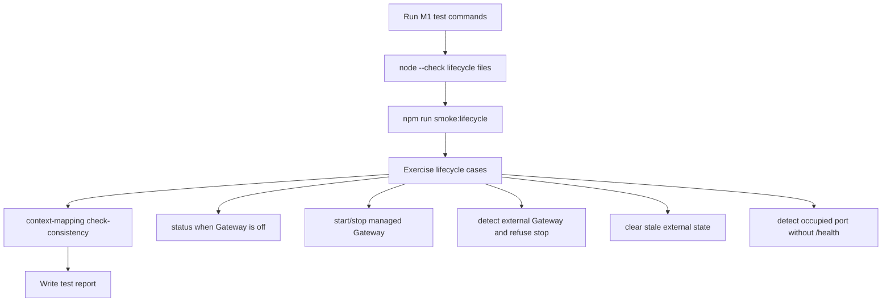

# M1_002 - Gateway Lifecycle Test Report

Milestone: `M1 - Tauri Gateway Lifecycle`

## Workflow



## Test Date

2026-05-25

## Module Under Test

Gateway lifecycle CLI:

```text
scripts/gateway-lifecycle.mjs
scripts/smoke-lifecycle.sh
scripts/test-port-occupier.mjs
```

## Commands Run

```bash
node --check scripts/gateway-lifecycle.mjs
node --check scripts/test-port-occupier.mjs
npm run smoke:lifecycle
python ../context-mapping/cli.py check-consistency .
```

## Result

PASS.

## Cases Covered

### Gateway Off

`gateway:status` returns:

```json
{
  "ok": false,
  "portOpen": false,
  "state": null
}
```

### Managed Start

`gateway:start` spawns Gateway and waits until `/health` returns:

```json
{
  "ok": true,
  "gateway": "running",
  "db": "ok",
  "worker": "running"
}
```

### Managed Stop

`gateway:stop` stops the managed process group and removes lifecycle state.

### Existing External Gateway

When Gateway is already healthy but started outside lifecycle manager:

```text
gateway:start -> action=already_running
gateway:stop  -> action=not_stopped
```

The external Gateway remains reachable after refused stop.

### Stale External State

After the external Gateway is stopped, `gateway:status` clears stale lifecycle state:

```json
{
  "staleStateCleared": true,
  "state": null
}
```

### Port Conflict

A test process occupies port `3000` without serving Gateway `/health`.

`gateway:start` reports:

```text
Gateway port is occupied but /health is not available: http://127.0.0.1:3000
```

The command exits with code `3`.

## Important Evidence

Smoke command finished with:

```text
LIFECYCLE_SMOKE_OK
```

Context consistency finished with:

```text
OK  Context files consistent.
```

## Residual Risk

Tauri Rust integration has not been implemented.

Restart-on-crash behavior has not been implemented.

The current lifecycle test covers WSL Debian local runtime only.

## Next Action

Build or scaffold the Tauri shell and connect it to the lifecycle behavior.

