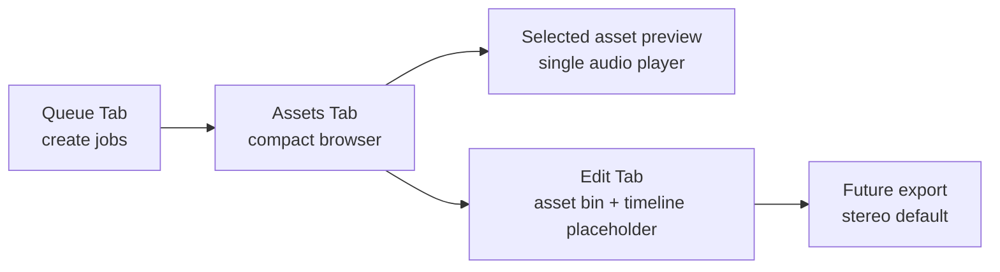

# M1_003 - Desktop UI Tabs And Theme Direction

Milestone: `M1 - Tauri Gateway Lifecycle`

## Workflow



## Wireframe

```text
┌────────────────────────────────────────────────────────────┐
│ Gateway Core                         [Light/Dark] [Ready] │
├────────────────────────────────────────────────────────────┤
│ [Queue] [Assets] [Edit]                                   │
├────────────────────────────────────────────────────────────┤
│ Queue Tab                                                  │
│ ┌────────────── Composer ──────────────┐ ┌──── Queue ────┐ │
│ │ Text / voice / speed / incognito     │ │ status table  │ │
│ └──────────────────────────────────────┘ └───────────────┘ │
└────────────────────────────────────────────────────────────┘

┌────────────────────────────────────────────────────────────┐
│ Assets Tab                                                 │
│ ┌──── Compact Asset List ────┐ ┌──── Selected Preview ───┐ │
│ │ ▶ text preview       1.0s  │ │ filename                │ │
│ │ ▶ text preview       1.0s  │ │ content                 │ │
│ │ ▶ text preview       1.0s  │ │ audio player            │ │
│ └────────────────────────────┘ └──────────────────────────┘ │
└────────────────────────────────────────────────────────────┘

┌────────────────────────────────────────────────────────────┐
│ Edit Tab                                                   │
│ ┌──── Asset Bin ────┐ ┌──────── Timeline ────────────────┐ │
│ │ + asset           │ │ 00:00  00:05  00:10  00:15       │ │
│ │ + asset           │ │ Voice | [clip placeholder]       │ │
│ └───────────────────┘ │ Music |                          │ │
│                       │                         [Export] │ │
│                       └──────────────────────────────────┘ │
└────────────────────────────────────────────────────────────┘
```

## What Was Implemented

The dev client now reflects the desktop UI direction:

```text
Queue tab
Assets tab
Edit tab placeholder
Light/Dark theme toggle
Compact assets list
Single selected asset preview
```

Implemented files:

```text
public/index.html
public/styles.css
public/app.js
.context/modules/DEV_CLIENT.md
```

## Design Patterns

### Typography Decision Artifact

An exploratory typography artifact exists at:

```text
docs/artifacts/typography-options.html
```

It previews VoiceFactory with multiple UI font combinations against the current Queue, Assets, and Edit surfaces.

Selected typography:

```text
UI / display: Manrope
Technical values: Geist Mono
```

The dev client loads these fonts in `public/index.html` and exposes them as CSS tokens in `public/styles.css`:

```text
--font-ui
--font-display
--font-mono
```

### Tabbed Workspace

The desktop app should separate major workflows:

```text
Queue  -> job creation and monitoring
Assets -> browsing and previewing generated audio
Edit   -> timeline arrangement and export
```

This prevents the asset list from carrying editing responsibilities.

### Master-Detail Assets

Assets use a compact list as master and a single preview panel as detail.

This avoids rendering a native audio player for every row, making the asset list much more compact and easier to scan.

### Future Timeline Editor

The Edit tab is a placeholder for future Sound Editor behavior:

```text
asset bin
timeline tracks
clip blocks
export stereo by default
```

The current button is disabled because ffmpeg export and timeline persistence are not implemented yet.

### Theme Preference

The dev client supports light and dark themes through CSS variables and localStorage.

The default is dark because long desktop testing sessions should be easier on the eyes.

## Verification

Run syntax checks:

```bash
source ~/.nvm/nvm.sh
nvm use 24
node --check public/app.js
```

Manual browser checks:

```text
open /
switch Light/Dark
switch Queue/Assets/Edit tabs
select asset row
confirm only selected asset renders full audio player
```

## Known Limits

Edit timeline is a placeholder only.

Add to Edit is disabled.

Export Stereo is disabled.

No timeline persistence exists yet.
