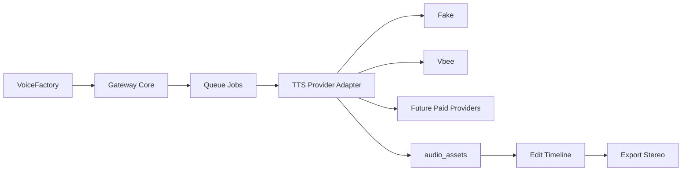

# M1_004 - VoiceFactory Rename And Provider Scope

Milestone: `M1 - Tauri Gateway Lifecycle`

## Workflow



## What Was Decided

The product name is now:

```text
VoiceFactory
```

The product scope is broader than Vbee:

```text
VoiceFactory = local-first TTS production app with pluggable TTS providers.
```

Vbee remains the first real provider target, but future paid TTS tools should be added through provider adapters.

## What Was Implemented

The dev client visible name was changed:

```text
ZeroClaw Vbee Automate -> VoiceFactory
```

Implemented files:

```text
public/index.html
.context/GLOBAL.md
.context/modules/DEV_CLIENT.md
.context/modules/TTS_PROVIDER_ADAPTERS.md
docs/design/06_voicefactory-provider-adapter-contract.md
```

## Design Pattern

### Provider Adapter

Provider-specific details must live behind adapters:

```text
Fake Provider
Vbee Provider
Future Paid Provider
```

The shared orchestration remains:

```text
JobRunner -> ProviderAdapter -> FileService -> audio_assets
```

This prevents provider-specific API/browser details from leaking into UI, queue, or timeline editing.

## Verification

Run:

```bash
node --check public/app.js
python ../context-mapping/cli.py check-consistency .
```

Manual check:

```text
open dev client
confirm header shows VoiceFactory
confirm Queue / Assets / Edit tabs still work
```

## Known Limits

The package name and repository folder have not been renamed yet.

Provider registry is not implemented yet.

Queue payload does not yet include provider selection.

Only fake provider exists in code today.

