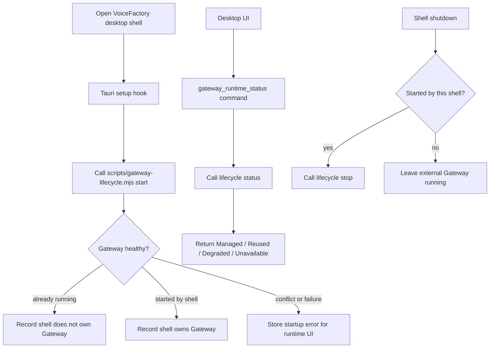

# M1_005 - Tauri Gateway Lifecycle Shell

Milestone: `M1 - Tauri Gateway Lifecycle`

## Workflow



## What Was Implemented

A Tauri shell scaffold was added for VoiceFactory. The shell reuses the tested Gateway lifecycle CLI instead of duplicating the startup policy in Rust.

Implemented behavior:

```text
desktop setup calls Gateway lifecycle start
healthy existing Gateway is reused
owned Gateway is tracked in shell state
shutdown stops only a shell-owned Gateway
runtime status/start/stop commands are exposed to the frontend
dev UI shows Browser, Managed, Reused, Degraded, or Unavailable desktop runtime state
```

Files added or changed:

```text
src-tauri/Cargo.toml
src-tauri/build.rs
src-tauri/tauri.conf.json
src-tauri/src/main.rs
src-tauri/src/lib.rs
src-tauri/src/gateway_lifecycle.rs
.context/modules/TAURI_SHELL.md
package.json
public/index.html
public/app.js
public/styles.css
```

## Design Pattern

### Thin Shell Over Tested Lifecycle

The shell calls:

```text
node scripts/gateway-lifecycle.mjs start|status|stop
```

This keeps all lifecycle rules aligned with the existing CLI smoke tests:

```text
do not spawn duplicate Gateway
do not kill external Gateway
report port conflict without killing the occupying process
only report started after /health is healthy
```

### Runtime Command Boundary

The frontend does not inspect processes or local files. It asks the Tauri backend for runtime state through commands:

```text
gateway_runtime_status
gateway_runtime_start
gateway_runtime_stop_if_owned
```

The Gateway API remains the only application data API for queue, assets, and audio playback.

## Verification

Commands run:

```bash
node --check scripts/gateway-lifecycle.mjs
node --check public/app.js
npm run smoke:lifecycle
```

The lifecycle smoke command finished with:

```text
LIFECYCLE_SMOKE_OK
```

JSON syntax was checked for:

```text
package.json
src-tauri/tauri.conf.json
```

## Known Limits

Rust/Tauri compile was not run because this machine does not currently have `cargo` or `rustc` available in Windows or WSL.

The desktop shell currently calls the Node lifecycle CLI. This is intentional for M1 because the CLI is the tested source of lifecycle behavior.

The desktop UI is still the static dev client served by Gateway; a full product frontend is not part of M1.
