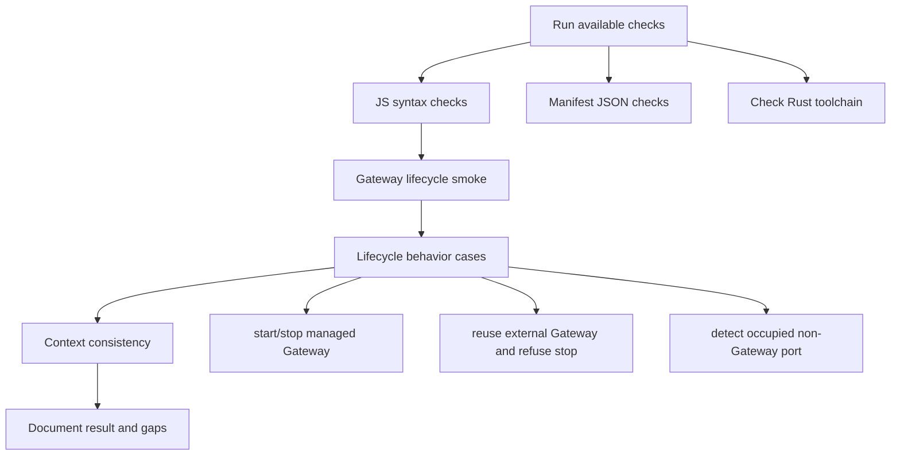

# M1_006 - Tauri Gateway Lifecycle Test Report

Milestone: `M1 - Tauri Gateway Lifecycle`

## Workflow



## Test Date

2026-05-26

## Module Under Test

Tauri Gateway lifecycle shell scaffold:

```text
src-tauri/
public/index.html
public/app.js
public/styles.css
scripts/gateway-lifecycle.mjs
```

## Commands Run

```bash
node --check scripts/gateway-lifecycle.mjs
node --check public/app.js
ConvertFrom-Json package.json
ConvertFrom-Json src-tauri/tauri.conf.json
npm run smoke:lifecycle
cargo test --manifest-path src-tauri/Cargo.toml
```

Toolchain discovery:

```bash
cargo --version
rustc --version
```

## Result

PASS.

JavaScript, JSON, lifecycle smoke, context, and Rust/Tauri unit checks passed.

## Cases Covered

### Gateway Off

`gateway:status` returned unavailable state with port closed.

### Managed Start

`gateway:start` spawned Gateway and waited for `/health` to return `ok=true`.

### Managed Stop

`gateway:stop` stopped the Gateway process started by lifecycle state.

### Existing External Gateway

When a Gateway was already healthy:

```text
gateway:start -> action=already_running
gateway:stop  -> action=not_stopped
```

The external Gateway remained reachable after refused stop.

### Port Conflict

A test process occupied port `3000` without Gateway `/health`.

`gateway:start` reported:

```text
Gateway port is occupied but /health is not available: http://127.0.0.1:3000
```

The command exited with the expected conflict path.

## Context Check

The configured context load command was attempted before implementation:

```bash
python3 ../context-mapping/cli.py load gateway/src . --include-manual
```

failed before implementation because `.context/gateway_src.md` does not exist. Module context was read directly from `.context/modules/*.md`, and a new `.context/modules/TAURI_SHELL.md` was added for the shell.

Final context commands were run after this report was added:

```bash
python3 ../context-mapping/cli.py check-consistency .
python3 ../context-mapping/cli.py build . --quiet
```

Both passed.

## Local Environment Stuck And Fixes

### Rust Toolchain

Initial Rust/Tauri compile could not run because `cargo` and `rustc` were missing. Rust was installed in WSL Debian with rustup for user `shinkuro`.

Current verification:

```bash
source /home/shinkuro/.cargo/env
rustc --version
cargo --version
```

Observed versions:

```text
rustc 1.95.0
cargo 1.95.0
```

### Cargo PATH

After Rust installation, a shell still reported:

```text
cargo: command not found
```

Fix:

```bash
source /home/shinkuro/.cargo/env
```

The local profile was adjusted to guard the explicit user path:

```bash
[ -f "/home/shinkuro/.cargo/env" ] && . "/home/shinkuro/.cargo/env"
```

This avoids a prior startup error where `$HOME` resolved to `/root` and tried to source `/root/.cargo/env`.

### Linux Tauri Dependencies

Tauri compile failed at first because `pkg-config` was missing.

Fix run by the human in WSL Debian:

```bash
sudo apt update
sudo apt install -y pkg-config libglib2.0-dev libgtk-3-dev libwebkit2gtk-4.1-dev libayatana-appindicator3-dev librsvg2-dev
```

Verification:

```bash
command -v pkg-config
pkg-config --version
```

Observed:

```text
/usr/bin/pkg-config
1.8.1
```

### Tauri Icon

Tauri compile then failed because `tauri::generate_context!()` expected:

```text
src-tauri/icons/icon.png
```

Fix: add a minimal tracked `src-tauri/icons/icon.png` placeholder and do not ignore `src-tauri/icons/`.

### Cargo Build Output

Cargo generated many untracked files under:

```text
src-tauri/target/
```

Fix: `.gitignore` now ignores `src-tauri/target/` and `src-tauri/gen/`.

## Residual Risk

Manual desktop window verification with `npm run desktop:dev` remains pending.

The current Tauri icon is a minimal placeholder required by Tauri compile-time context generation.

## Next Action

Run the desktop shell manually:

```bash
npm run desktop:dev
```
