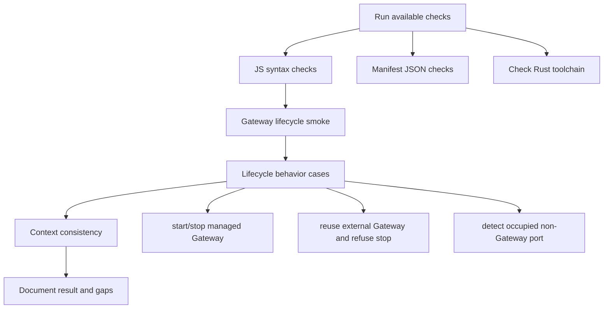

# M1_006 - Tauri Gateway Lifecycle Test Report

Milestone: `M1 - Tauri Gateway Lifecycle`

## Workflow



## Test Date

2026-05-26

## Module Under Test

Tauri Gateway lifecycle shell scaffold:

```text
src-tauri/
public/index.html
public/app.js
public/styles.css
scripts/gateway-lifecycle.mjs
```

## Commands Run

```bash
node --check scripts/gateway-lifecycle.mjs
node --check public/app.js
ConvertFrom-Json package.json
ConvertFrom-Json src-tauri/tauri.conf.json
npm run smoke:lifecycle
```

Toolchain discovery:

```bash
cargo --version
rustc --version
```

## Result

PARTIAL PASS.

Available JavaScript, JSON, and lifecycle smoke checks passed.

Rust/Tauri compile was not run because both `cargo` and `rustc` are missing in the current Windows shell and WSL Debian environment.

## Cases Covered

### Gateway Off

`gateway:status` returned unavailable state with port closed.

### Managed Start

`gateway:start` spawned Gateway and waited for `/health` to return `ok=true`.

### Managed Stop

`gateway:stop` stopped the Gateway process started by lifecycle state.

### Existing External Gateway

When a Gateway was already healthy:

```text
gateway:start -> action=already_running
gateway:stop  -> action=not_stopped
```

The external Gateway remained reachable after refused stop.

### Port Conflict

A test process occupied port `3000` without Gateway `/health`.

`gateway:start` reported:

```text
Gateway port is occupied but /health is not available: http://127.0.0.1:3000
```

The command exited with the expected conflict path.

## Context Check

The configured context load command was attempted before implementation:

```bash
python3 ../context-mapping/cli.py load gateway/src . --include-manual
```

failed before implementation because `.context/gateway_src.md` does not exist. Module context was read directly from `.context/modules/*.md`, and a new `.context/modules/TAURI_SHELL.md` was added for the shell.

Final context commands were run after this report was added:

```bash
python3 ../context-mapping/cli.py check-consistency .
python3 ../context-mapping/cli.py build . --quiet
```

Both passed.

## Residual Risk

The Rust source has not been compiled locally.

The Tauri CLI is referenced by `npm run desktop:dev` and `npm run desktop:build`, but no Node or Rust packages were installed during this slice.

Manual desktop verification remains pending until the local Rust/Tauri toolchain is available.

## Next Action

Install or provide the approved Rust/Tauri toolchain, then run:

```bash
npm run desktop:dev
cargo test --manifest-path src-tauri/Cargo.toml
```
